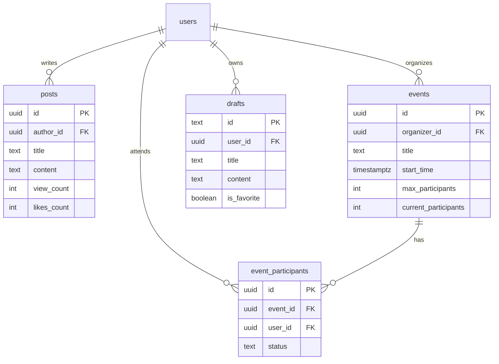

# API 变更日志

## 2026-02-04 核心模块全链路升级

### 新增 API (RPC)
- `register_for_event_transaction(p_event_id, p_user_id)`: 事务级活动报名，自动处理并发锁和名额检查。

### 数据库变更
- **Events**: 新增 `events` 表（活动管理）和 `event_participants` 表（报名记录）。
- **Drafts**: 新增 `drafts` 表，用于创作中心草稿的云端同步。
- **Analytics**: 废弃前端 Mock 数据，全面对接 `posts`, `likes`, `comments` 表进行实时聚合查询。

### 服务层变更
- **AnalyticsService**:
  - `getMetricsData`: 移除 Mock，改为根据 Supabase 数据实时聚合。
  - `getWorksPerformance`: 直接查询 `posts` 表并按 `view_count` 排序。
- **DraftService**:
  - `saveDraft`: 增加 `syncToCloud` 逻辑，支持本地优先+云端备份策略。
  - `getAllDrafts`: 自动合并本地缓存与云端数据。
- **FileService**:
  - 增加 Supabase Storage 上传逻辑，支持图片自动重命名和 URL 获取。
- **UserService**:
  - `updateUser`: 增加 Supabase Auth Metadata 同步，确保 `auth.users` 和 `public.users` 数据一致。

---

# 数据库 ER 图更新

