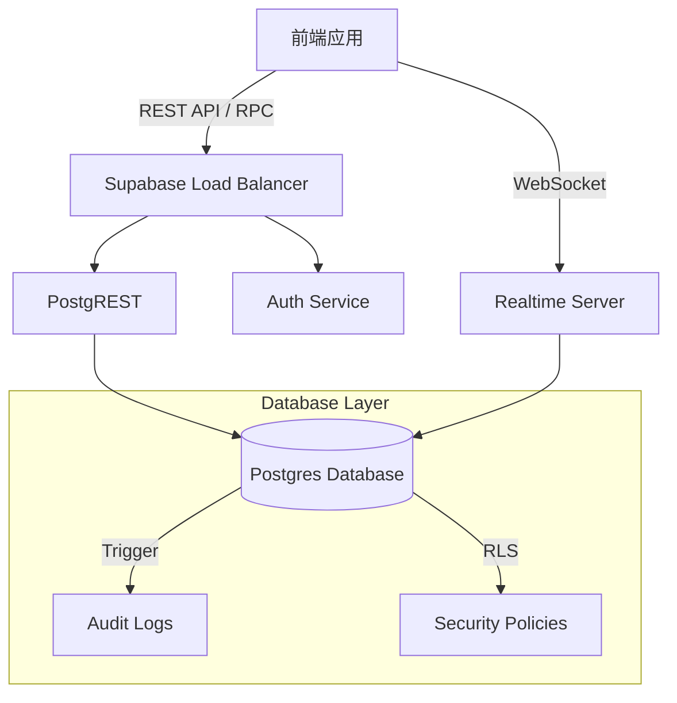

# Supabase 全链路集成与维护手册

## 1. 集成架构概览

本平台采用 Supabase 作为核心后端服务，涵盖数据库 (Postgres)、实时通信 (Realtime)、身份认证 (Auth) 和对象存储 (Storage)。



## 2. 核心功能实现

### 2.1 事务级一致性 (RPC)
为了确保多表操作的原子性（如发布帖子同时更新用户统计），我们不使用客户端多步请求，而是调用存储过程。

**关键 RPC 函数**:
- `create_post_transaction`: 创建帖子 + 更新用户发帖数 + 更新社区发帖数。
- `toggle_like_transaction`: 点赞/取消点赞 + 更新帖子点赞数。

**调用示例**:
```typescript
const { data, error } = await supabase.rpc('create_post_transaction', {
  p_title: 'Title',
  p_content: 'Content',
  p_author_id: userId,
  // ...
});
```

### 2.2 审计日志 (Audit Logs)
系统已部署数据库级触发器，自动记录关键表的变更。

- **表名**: `public.audit_logs`
- **触发器**: `log_audit_event()`
- **监控范围**: `users`, `posts`, `communities`, `comments`

**查询示例 (SQL)**:
```sql
-- 查询某条帖子的变更历史
SELECT * FROM audit_logs 
WHERE table_name = 'posts' AND record_id = 'POST_UUID'
ORDER BY created_at DESC;

-- 查询某管理员的操作记录
SELECT * FROM audit_logs 
WHERE changed_by = 'ADMIN_UUID';
```

### 2.3 实时订阅与容错
`PresenceService` 已增强断线重连逻辑。当 WebSocket 断开时，系统会自动尝试重连（指数退避策略）。

## 3. 安全策略 (RLS)

所有核心表均已启用 RLS (Row Level Security)。

| 表名 | 策略简述 |
| :--- | :--- |
| `users` | 公开只读，仅自己可修改 (Update) |
| `posts` | 公开只读，仅作者可修改/删除 |
| `audit_logs` | **严禁公开访问**，仅 Service Role 可写，管理员可读 |

## 4. 上线检查清单 (Go-Live Checklist)

### 基础设施
- [ ] `.env.local` 中 `VITE_SUPABASE_URL` 和 `KEY` 配置正确。
- [ ] 数据库 Migration 已全部执行 (`supabase/migrations/`).
- [ ] `audit_logs` 表已创建且触发器生效。

### 数据一致性
- [ ] 运行 `node scripts/check-data-consistency.js` 确保统计字段准确。
- [ ] 确认没有残留的 `localhost:3022` 请求（Mock 服务已清理）。

### 监控与告警
- [ ] 关注 Supabase Dashboard 的 Database Health。
- [ ] 关注前端 Console 中的 `Supabase Operation Failed` 错误日志。

## 5. 故障排查

**Q: 写入数据报错 "new row violates row-level security policy"**
A: 检查当前用户的 Session 是否过期，或者操作的记录是否属于该用户。对于 `audit_logs`，确保是通过 Trigger 写入而非客户端直接写入。

**Q: 实时状态不更新**
A: 检查 Network 面板 WebSocket 连接状态。如果是 `CHANNEL_ERROR`，系统会自动重试，请检查 Supabase 配额是否超限。

**Q: 统计数据不准**
A: 运行一致性校验脚本，并在必要时手动执行 SQL 修复：
```sql
UPDATE users u SET posts_count = (SELECT count(*) FROM posts WHERE author_id = u.id);
```
